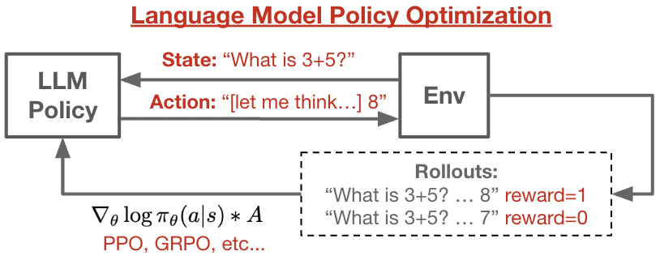
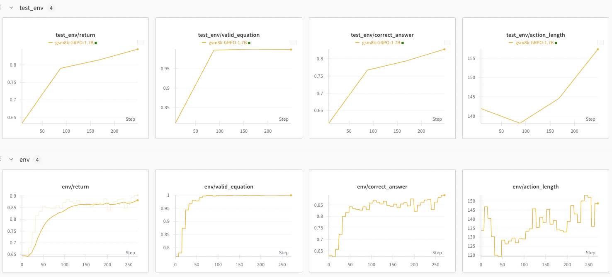

# lmpo: A minimal repo for Language Model Policy Optimization

This repo is a standalone implementation of using reinforcement learning to post-train language models. The focus is on ease-of-understanding for research. Please fork and/or play with the code! The `lmpo` repository is built using JAX, and has no major external dependencies. The core logic is around 400 lines of code, split into three files.

(We do depend on the huggingface tokenizer, because I can't figure out how it works to replicate it. If anyone knows, please let me know...)



## Repo Structure
- `grpo.py` -- Start here. It contains the main code for training a model via GRPO/PPO.
- `sampling.py` -- This file contains an implementation of batched autoregressive sampling using a KV cache.
- `eval.py` -- Helpers function for evaluating a model checkpoint on a given environment.
- `envs/` -- In this folder, we've implemented a few classic LLM RL environments, including evaluation logic.
- `models/` -- Utils for defining model architecture. Currently supports Qwen3 of various sizes.
- `utils/` -- General utilities like sharding, checkpointing, logging.

This repo is intentionally built to be easy to modify. If you read `grpo.py`, all the main logic is there. No crazy abstractions. Some more details:
- The code currently supports Qwen3 models, and was tested with Qwen3-0.6B, Qwen3-1.7B, and Qwen3-8B.
- This repo was written to support multi-host TPU training, but it also works on a single host and on GPUs. By default, the model is sharded via FSDP.
- All model calls are JIT compiled.
- Our sampling code is compiled, but may not be as efficient as e.g. vllm.
- Only bandit (e.g. single-action) environments are supported at the moment. We've implemented some synthetic tasks like `countdown`, and also classic benchmarks like `GSM8K`.


## Setup
First, you will want to install the dependencies:
```bash
pip install numpy absl-py ml-collections wandb einops jaxtyping opt-einsum transformers tqdm jax==0.6.1 jaxlib==0.6.1 optax==0.2.5 flax==0.10.6 chex==0.1.89
# You may need to install "jax[cuda12]" or "jax[tpu]" depending on your system.
```

Then, download the Qwen checkpoints and convert into a Jax checkpoint.
```bash
python models/download_model.py --model_id Qwen/Qwen3-1.7B --dest_root_path ~/checkpoints/hf/
python models/hf_to_jax.py --hf_dir ~/checkpoints/hf/Qwen3-1.7B/ --ckpt_dir ~/checkpoints/Qwen3-1.7B/

# On a multi-host machine, use:
TPU_CHIPS_PER_PROCESS_BOUNDS=2,2,1 TPU_PROCESS_BOUNDS=1,1,1 TPU_VISIBLE_DEVICES=0,1,2,3 python models/hf_to_jax.py
```

To test if everything worked, you can try running the sampling code.
```bash
python core/sampling.py --ckpt_dir ~/checkpoints/Qwen3-1.7B/
```

To train GRPO, try the following command to train against PoemLength. This is a very easy environment, where reward is proportional to number of output characters. You should see `return` reach 1900 within 200 steps, in about 10 minutes.
```bash
python core/grpo.py --wandb_name Poem --env_name Poem --model_dir ~/checkpoints/Qwen3-1.7B/ --groups_per_batch 32
```

## Results

`Countdown` is an environment where the agent needs to manipulate four numbers to form a desired result, using only mathematical primitives. This was used in the [TinyZero](https://github.com/Jiayi-Pan/TinyZero) project.
```
######################### User Message
Using the numbers [52, 23, 1, 35], create an equation that equals 64. You can use basic arithmetic operations (+, -, *, /) and each number can only be used once. Show your work in <think> </think> tags. Think for only ten sentences, then return the final answer in <answer> </answer> tags, for example <answer> (1 + 2) / 3 </answer>.
######################### Assistant Output
<think>
Okay, let's see. I need to use the numbers 52, 23, 1, and 35 exactly once each with basic operations to make 64. Hmm. Let me start by thinking about possible combinations.
First, maybe I can try adding some numbers. 52 + 23 is 75. Then 75 minus something? 75 - 1 is 74, then 74 minus 35 is 39. No, that's not helpful. How about multiplying? 52 divided by 1 is 52. Then 52 plus 35 is 87. 87 minus 23 is 64. Wait, that works! Let me check: (52 / 1) + 35 - 23 = 52 + 35 is 87, 87 - 23 is 64. Yes! So the equation would be (52 / 1) + 35 - 23 = 64. Let me make sure each number is used once: 52, 1, 35, 23. Yep, all used. Perfect.
</think>
<answer> (52 / 1) + 35 - 23 </answer>
```
We can train an agent against synthetic Countdown tasks. Use the following command:
```bash
python core/grpo.py --env_name countdown --model_dir ~/checkpoints/Qwen3-1.7B/
```


The training run will automatically plot results to wandb. We can also evaluate the saved checkpoints on a deterministic test set:
```bash
python core/eval.py --env_name Countdown --model_dir ~/checkpoints/countdown/step60
```
| Step          | Score         |
| ------------- | ------------- |
| 0             | 0.446         |
| 20            | 0.67          |
| 40            | 0.68          |
| 60            | 0.75          |


`GSM8K` is a set of math tasks. The agent receives a reward of 1 if it correctly answers the problem. We will train on the training set, and evaluate on a held-out test set.
```
######################### User Message
Allyn is a golfer. At the starting tee, he hit the golf ball and it traveled 180 yards straight toward the hole.  On his second turn, he hit the ball again straight toward the hole and it traveled half as far as it did on his first turn, but the ball landed 20 yards beyond the hole.  On his third swing, he hit the ball onto the green and it rolled into the hole.  What is the distance, in yards, from the starting tee to the hole?
######################### Assistant Output
Let's break down the problem step by step:

1. On the first swing, Allyn hit the ball 180 yards straight toward the hole.
2. On the second swing, the ball traveled half as far as the first swing, so $ \frac{180}{2} = 90 $ yards.
3. However, the ball landed 20 yards beyond the hole, so the total distance from the starting tee to the hole is $ 180 + 90 - 20 = 250 $ yards.

Therefore, the distance from the starting tee to the hole is:

<answer>
250
</answer>
```
To train an agent on GSM8K:
```bash
python core/grpo.py --env_name gsm8k --model_dir ~/checkpoints/Qwen3-1.7B/ --test_env_name gsm8k-test
```


**TODO**. We have [Deepscaler](https://pretty-radio-b75.notion.site/DeepScaleR-Surpassing-O1-Preview-with-a-1-5B-Model-by-Scaling-RL-19681902c1468005bed8ca303013a4e2) environments implemented, but this agent is still training.
```bash
python core/grpo.py --env_name deepscaler --save_dir /nfs/gcs/checkpoints/lmpo/deepscaler --test_env_name aime --num_generation_tokens 1024 --inference_batch_per_device 2 --prompt_length 512
```

## Overview of RL for LLMs

Reinforcement learning for LLMs is not too different from classical deep reinforcement learning. The overall loop is exactly the same (if you squint, the top figure above is just the usual RL loop). When building an RL system, we generally focus on two components -- **rollout generation**, and **policy improvement**.

**Rollout generation** involves sampling from our current policy and interacting with the environment. Most LLM environments are "bandit" settings, meaning that the agent only takes a single action, and recieves a reward accordingly. Some LLM-RL environments are [multi-turn](https://lmrl-gym.github.io/) but it's less common as of today. The bottleneck in LLM rollout generation is usually sampling from the policy itself, which requires autoregressive token generation. For policy gradient RL methods (e.g. PPO), we will generate a batch of rollouts at at the same time. Each rollout will be labelled with a scalar reward according to the environment's evaluation criteria.

**Policy improvement**. Once we have our batch of rollouts, the next step is to update our policy.
- Policy gradient methods follow the general form of $\theta \rightarrow E[\nabla_\theta \log \pi_\theta(a|s) * A(s,a)]$, where $A$ is advantage.
- We don't know the true advantage of an action, but we can estimate it from reward samples. 
    - Advantage is defined as the difference in expected reward from taking a specific action, vs. sampling an action from the policy: $A(s,a) = R(s,a) - E[R(s)]$.
    - In general we don't know $R(s,a)$ or $R(s)$, so they need to be estimated.
    - The standard estimator for $R(s,a)$ is Monte Carlo estimation, which just means taking lots of samples and averaging them. LLM RL methods basically all do this. For a deterministic bandit environment, a single Monte Carlo estimate will just tell you the true reward.
    - The simplest *value* estimator for $R(s)$ is simply $R(s) = 0$. This is actually fine, and works decently well.
    - In GRPO-style methods, we can estimate $R(s)$ using Monte Carlo estimation over a group of rollouts.
    - In classical PPO methods, we can use a learned value function and parameterize $R(s)$ as the output of a neural network.
- Policy gradient methods are meant to use on-policy rollouts. But we usually want to train on slightly stale rollouts as well.
    - We can use *importance sampling* to account for this discrepancy. Instead of the policy gradient above, we can use: $\nabla_\theta \log (\pi_\theta(a|s) / \hat{\pi}(a|s))$ where $\hat{\pi}$ is the old policy used for rollout generation. In deep RL, the old policy is just an older set of parameters. In practice, we often store the "old logprobs" during rollout sampling, and divide them out accordingly.
    - In LLM RL, we might use a different computational graph for sampling and training. This means that the model output may be slightly different due to numerical issues. For that reason, it is common to recompute the old-logprobs during the start of each training step. We do that in this repo.
- We often want to constrain the policy update to not make drastic changes. PPO provides machinery to do this in a simple way.
    - Rather than naively maximizing $\log (\pi_\theta(a|s) / \hat{\pi}(a|s)) * A$, we maximize a *clipped* version -- $clip(\log (\pi_\theta(a|s) / \hat{\pi}(a|s)) * A, -0.2, 0.2)$.
    - Intuitively, we are saying that regardless of how high the advantage is, we only want our policy to change by $\pm 0.2$ relative log-probabililty.
    - In practice, PPO uses an asymmetric clipping -- only positive advantages are clipped, but negative advantages are left untouched. This creates a 'conservative' update that fullly avoids negative advantaged actions.


## References

This repo uses machinery collected from a few places:
- Utils from the jaxtransformer library: https://github.com/kvfrans/jaxtransformer
- Qwen model derived from: https://github.com/jax-ml/jax-llm-examples/tree/main/qwen3
- Countdown env from https://github.com/open-thought/reasoning-gym/blob/main/reasoning_gym/games/countdown.py
- Deepscaler env: https://pretty-radio-b75.notion.site/DeepScaleR-Surpassing-O1-Preview-with-a-1-5B-Model-by-Scaling-RL-19681902c1468005bed8ca303013a4e2